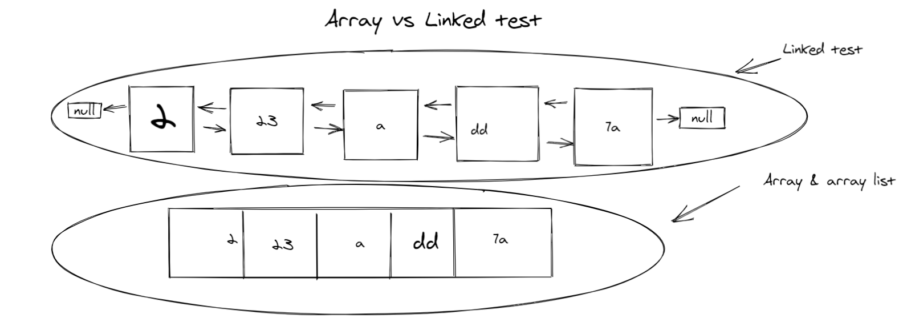

# Linked Lists

**Big O(oh) notation is used to describe the efficiency of an algorithm or function. This efficiency is evaluated based on 2 factors:**

* Running Time (also known as time efficiency / complexity)
The amount of time a function needs to complete.

* Memory Space (also known as space efficiency / complexity)
The amount of memory resources a function uses to store data and instructions.

|||
|---|---|
|Linked Lists| a sequence of Nodes that are connected/linked to each other. The most defining feature of a Linked List is that each Node references the next Node in the link.|
|linear data structures|there is a sequence and an order to how they are constructed and traversed|
|Non-linear data structures| items don’t have to be arranged in order, which means that we could traverse the data structure non-sequentially|

***data structures, which are the different ways that we can organize our data; variables, arrays, hashes, and objects are all types of data structures.***

##### Linked List vs Array

||array|linked list|
|----|-------|-----|
|Size:|nce data can only be stored in contiguous blocks of memory in an array, its size cannot be altered at runtime due to the risk of overwriting other data|linked list, each node points to the next one such that data can exist at scattered (non-contiguous) addresses; this allows for a dynamic size that can change at runtime.|
|Memory allocation|For arrays at compile time and at runtime|linked lists. but, a dynamically allocated array also allocates memory at runtime.|
|Execution time|Any element in an array can be directly accessed with its index;|in the case of a linked list, all the previous elements must be traversed to reach any element.|

 #### &copy; Dima Alabsi; 2021
